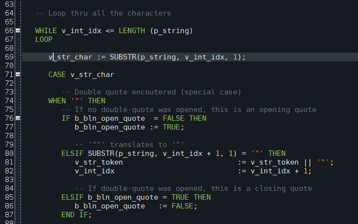
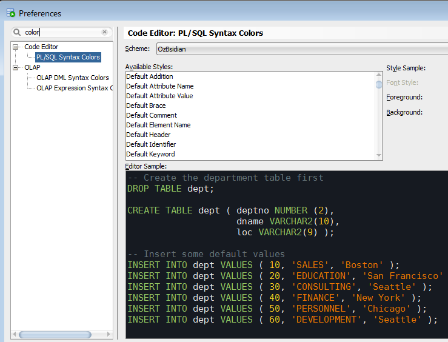

# OzBsidian colour scheme for Oracle SQL Developer #

This is a spinoff of Obsidian colour scheme for Oracle SQL Developer. It is based on Obsidian colour scheme for [Notepad++](http://notepad-plus-plus.org/).

## Installation ##

Unfortunately Oracle doesn't make it easy to import a new colour scheme into SQL Developer, thus a little bit of hacking is required.

- Locate file `dtcache.xml` in the SQL Developer's settings directory. On my system it is located in directory `C:\Users\s48\AppData\Roaming\SQL Developer\system4.0.3.16.84\o.ide.12.1.3.2.41.140908.1359`

- Locate `<schemeMap>` tag inside dtcache.xml file. Insert the content of `ozbsidian-scheme.xml` file inside `<schemeMap>` alongside the other colour schemes. Be careful not to break the XML.

- Launch SQL Developer. Navigate to menu Tools->Preferences, then select item Code Editor -> PL/SQL Syntax Colours in the left pane.

- Select "OzBsidian" in the "Scheme" drop down list on the top.

